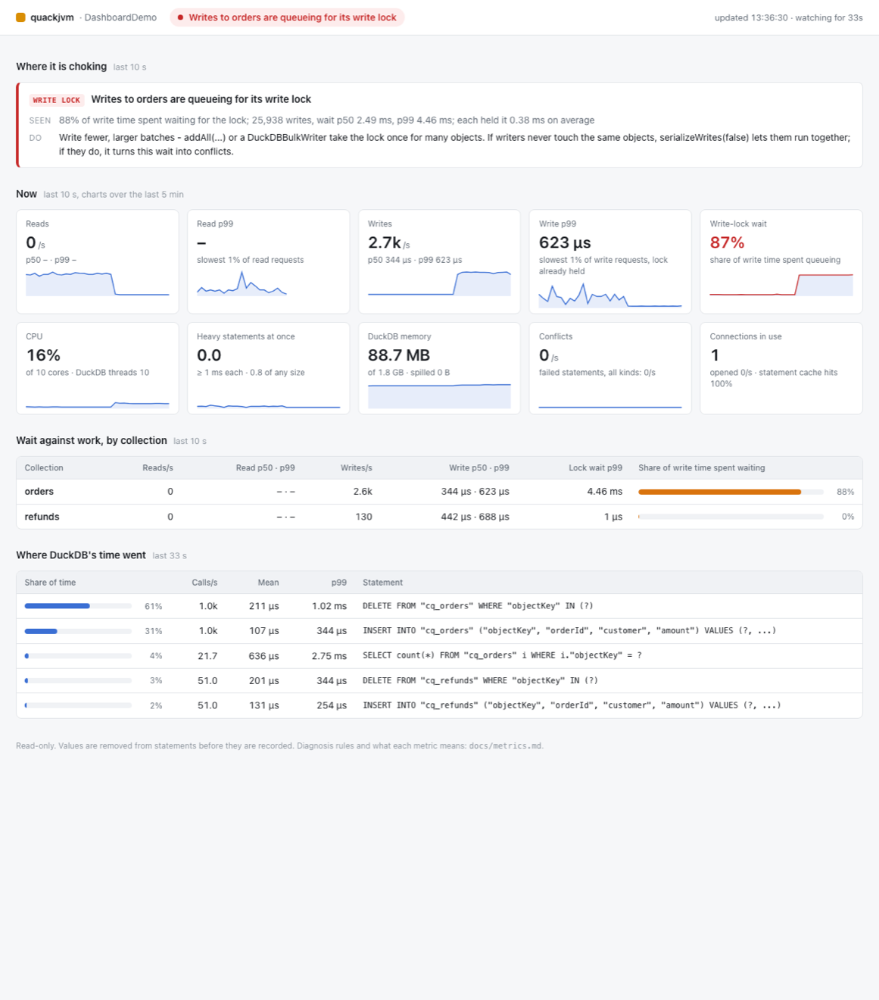
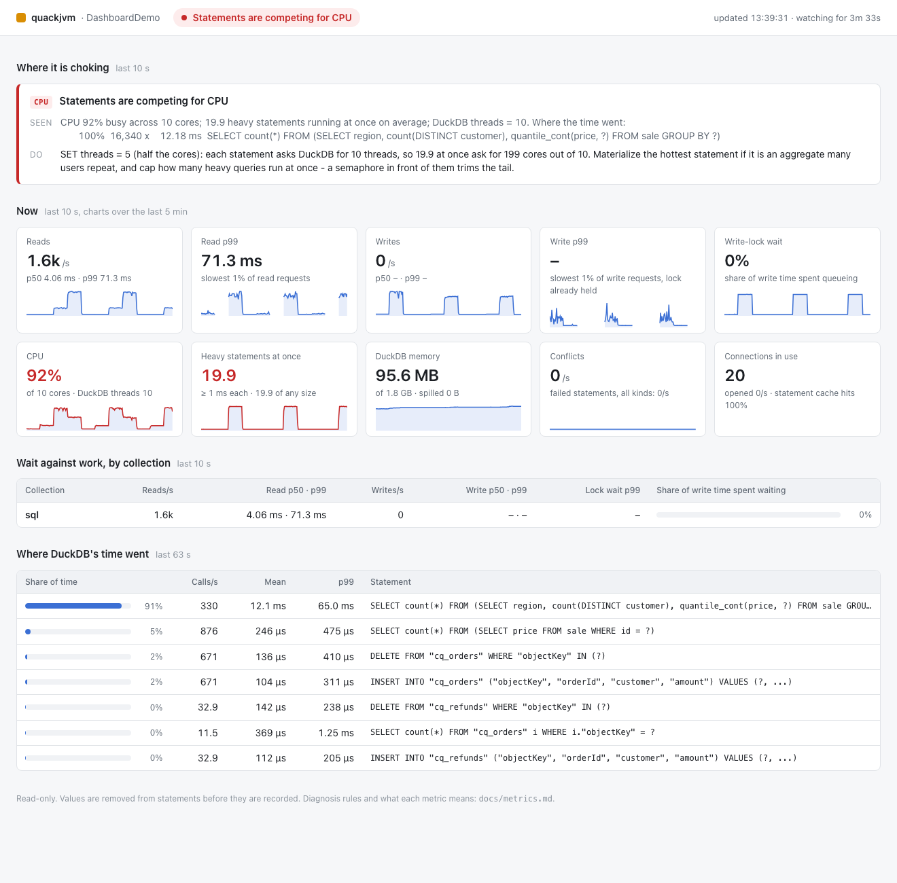

# Dashboard

The dashboard is a live web page for a running application. It shows where quackjvm is spending
its time, and whether that time is spent working or waiting. It reads the
[metrics](metrics.md) and runs the same `Diagnosis` on the last ten seconds, once a second.



## Starting it

Add the module:

```xml
<dependency>
    <groupId>io.github.bdarwin</groupId>
    <artifactId>quackjvm-dashboard</artifactId>
    <version>1.1.0</version>
</dependency>
```

Then start it with one line:

```java
QuackDashboard dashboard = QuackDashboard.start(database.metrics(), 8090);
System.out.println(dashboard.url());        // http://127.0.0.1:8090/
```

The module depends only on `quackjvm-core`. It uses the JDK's own HTTP server with two daemon
request threads and one sampling thread, so it won't keep the JVM alive. Call `close()` to stop it.

`QuackDashboard.builder(metrics)` also takes these options:
- `title("orders-service")`: shown in the header
- `history(Duration.ofMinutes(15))`: how far back the charts go (5 minutes by default)
- `port(0)`: pick a free port
- `bindAddress(...)`: see below

## What it shows

**Where it is choking.** The findings from `Diagnosis` for the last ten seconds, most severe
first. Each finding says what was seen and what to change. When nothing is found, the page says
so.

**Now.** The headline numbers for the last ten seconds, each with five minutes of history:
- reads and writes per second, and their p50 and p99 times
- the share of write time spent queueing for a write lock
- CPU for the whole machine, and for this process (including DuckDB's native threads)
- how many heavy statements (1 ms or more) were running at once
- DuckDB's memory against its limit, and bytes spilled to disk
- conflicts per second
- connections in use, and the statement-cache hit rate

A tile turns red when its number is in the range that triggers a diagnosis.

**Wait against work, by collection.** For each collection: reads per second with their times,
writes per second with their times, the p99 wait for the write lock, and the share of write time
spent waiting. This table shows *which* collection is choking. In the screenshot above, writes to
`orders` spend 88% of their time waiting, while `refunds`, in the same database, waits 0%.

**Where DuckDB's time went.** Statements from the last minute, ranked by their share of total
statement time. Statements that differ only in their values count as one: `IN (?, ?, ?)` and
`IN (?, ?)` are the same statement. Click a statement, or tick **Show full SQL**, to see all of it laid out a
clause per line, with its calls, mean, p50, p99 and total time, and a button to copy it - to run
`EXPLAIN ANALYZE` on, say. Statements are kept up to 4,000 characters. A statement tagged
**heavy** averaged 1 ms or more a call: long enough for DuckDB to run it on several threads, and
what the CPU diagnosis counts. A light statement near the top costs by how often it runs, not by
what it asks.

**Other programs using the cores.** CPU for this process alone would miss half the story: another
program on the machine starves DuckDB just as badly as DuckDB's own queries do. When other
programs hold a quarter of the machine or more, the page names the busiest ones, with their pid
and their share. On an idle machine it doesn't look at all.

- **Linux and Windows:** it reads each process's CPU time through Java's `ProcessHandle`.
- **macOS:** Java can't see other processes' CPU there (measured: of 735 processes, only itself).
  So the dashboard runs `/bin/ps` instead, with fixed arguments and no shell, in about 40 ms, at
  most every five seconds.

It records each program's name and pid, never its arguments, since those can hold passwords.
Turn it off with `watchOtherProcesses(false)`.



With twenty users running heavy aggregates on ten cores, it reports 92% CPU with 19.9 heavy
statements running at once. It names the statement responsible, and says that setting `threads`
to 5 would stop the queries asking for 199 cores between them.

## Recording for later analysis

While the dashboard runs, it also writes what it samples to disk. By default that goes to
`quackjvm-metrics/` under the working directory, and the page footer shows where. The files are
JSON Lines, one file of each kind per day (UTC), and DuckDB reads them directly:

| file | written | one line per |
|---|---|---|
| `metrics-DATE.jsonl` | every second | second: the headline numbers the page shows, plus raw prepare hits and misses |
| `statements-DATE.jsonl` | every 10 s | statement shape that ran: calls, total, mean, p50, p99 |
| `collections-DATE.jsonl` | every 10 s | collection used: reads and writes with their times, lock wait, wait share |
| `findings-DATE.jsonl` | every 10 s | cause the diagnosis found, with its evidence and advice |
| `processes-DATE.jsonl` | when other programs hold 25% of the machine, at most every 5 s | other program using 2% or more of the machine: name, pid, share |

Every line has a `ts`, which DuckDB reads as a `TIMESTAMP`. These queries were run against a
recording of `DashboardDemo`:

```sql
-- When did it choke, and on what?
SELECT strftime(ts, '%H:%M:%S') AS at, cause, round(severity, 2) AS severity
FROM 'quackjvm-metrics/findings-*.jsonl' ORDER BY ts;

-- The shape of the load, 15 seconds at a time
SELECT time_bucket(INTERVAL 15 seconds, ts) AS window,
       round(avg(writesPerSecond)) AS writes_s, round(max(writeP99), 2) AS write_p99_ms,
       round(avg(lockWaitShare), 2) AS lock_wait, round(avg(cpu), 2) AS cpu,
       round(avg(machineCpu), 2) AS machine_cpu, round(avg(heavyStatementsAtOnce), 1) AS heavy
FROM 'quackjvm-metrics/metrics-*.jsonl' GROUP BY ALL ORDER BY 1;

-- Which statements the database spent its time on, over the whole recording
SELECT shape, sum(count) AS calls, round(sum(totalMillis) / 1000, 1) AS seconds
FROM 'quackjvm-metrics/statements-*.jsonl' GROUP BY shape ORDER BY seconds DESC LIMIT 10;
```

Lines are flushed every second, so you can query the files while the application runs.

**How much disk it uses.** The per-second file is about 45 MB a day. The other three add a few MB
for each active collection and statement shape. Files older than seven days are deleted when a
new day's files start. Only files named in this pattern are ever deleted, not anything else in
the directory.

**Changing it:**
- `recordTo(Path)` records somewhere else.
- `retention(Duration)` keeps the files for longer or shorter.
- `recordTo(null)` turns recording off.

If the directory can't be written, or the disk fills, recording stops and the page shows why. The
dashboard and the application carry on.

## Security

The defaults are safe for a production process:

- **Loopback only.** It listens on `127.0.0.1`, so only processes on the same machine can reach
  it. Use an SSH tunnel to look from elsewhere: `ssh -L 8090:127.0.0.1:8090 host`.
- **DNS rebinding is refused.** A web page on another site could point a name it controls at
  `127.0.0.1` and read the dashboard through your browser. To prevent that, requests are answered
  only when addressed to `localhost`, `127.x.x.x` or `[::1]`. Anything else gets a 403.
- **Read-only.** It only answers `GET` and `HEAD`. There is no endpoint that runs SQL, changes a
  setting or triggers any work.
- **No data values**, on the page or in the recorded files. Numbers and quoted strings are removed from statements before they are
  recorded. The page shows `WHERE id = ?`, never `WHERE id = 42`.
- **Other programs are named, not described.** When it lists what else is using the cores, it
  shows each program's name and pid, never its command line.
- **A strict page.** `Content-Security-Policy: default-src 'self'` and `X-Frame-Options: DENY`
  are set. Script and styles are served from the dashboard itself, and every value is inserted
  as text, never as markup.

Calling `bindAddress(...)` with a non-loopback address makes the page reachable from that network,
and turns off the host check. Only do that behind whatever already protects your internal tools.

## Trying it

`examples/src/main/java/DashboardDemo.java` changes its load every half minute:
1. a quiet period
2. eight threads queueing for one collection's write lock
3. twenty users running heavy reports, competing for CPU
4. SQL built with the values pasted in

Open the printed address and watch the diagnosis change with each phase.

```
cd examples
mvn -q generate-resources
java --enable-native-access=ALL-UNNAMED -Xmx4g -cp "$(cat target/classpath.txt)" \
     src/main/java/DashboardDemo.java
```
